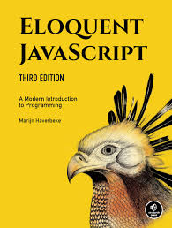

## ELOQUENT JAVASCRIPT: A modern Introduction to Programming
### By Marijn Haverbeke

<b>Solutions To The Exercises</b>

This repository contains my solutions to the End-of-chapter exercises in the book. Below are the solutions in chronological order.__
If you happen to be a student too, feel free to *clone/download* this repo to further widen your understanding of the topics in this book.
:point_up: **Don't send pull requests please.**

